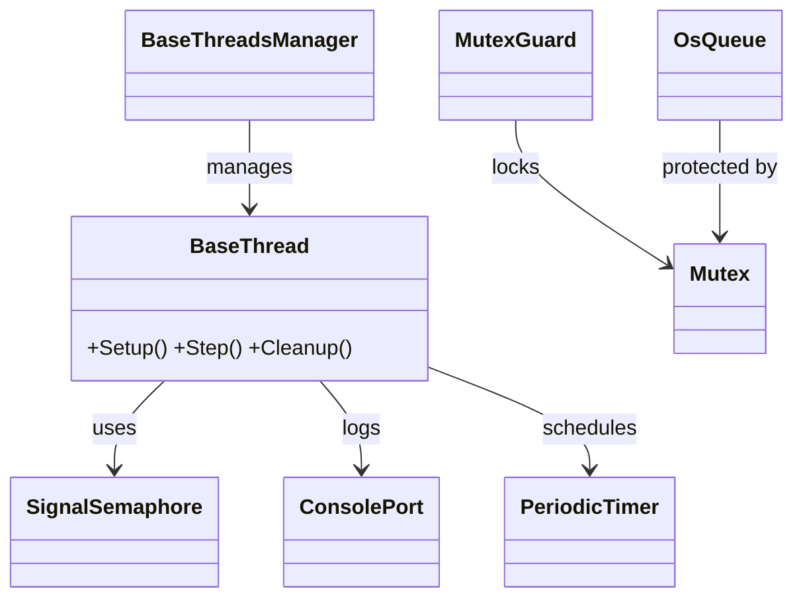

# HF-RTOSW-ESPIDF

Hardware-agnostic RTOS helper library for ESP‑IDF. It wraps FreeRTOS primitives with
friendly C/C++ helpers so your firmware can stay focused on the real work. ✨

Why use it? FreeRTOS can be verbose and repetitive. These utilities keep your application
neat while remaining fully compatible with ESP‑IDF. From threads to queues and now timers,
everything lives under one portable umbrella.

Looking for guides? Head over to the [documentation index](docs/index.md).

## 📜 Table of Contents
1. [Features ✨](#features-✨)
2. [Architecture 📜](#architecture-📜)
3. [Getting Started 🏁](#getting-started-🏁)
4. [Example Usage 💻](#example-usage-💻)
5. [Documentation 📚](#documentation-📚)
6. [License 📄](#license-📄)

## Features ✨
|   | Description |
|---|-------------|
| 💚 **C & C++ helpers** | Wrappers for FreeRTOS tasks, queues, semaphores and timers. |
| 💌 **`BaseThread`** | Abstract class simplifying long-running threads with start/stop verification. |
| 🔒 **Synchronization** | `Mutex`, `MutexGuard`, `SignalSemaphore`, `OsEventFlags` and `CriticalGuard`. |
| 🖊️ **ConsolePort** | Lightweight logging interface mirroring ESP-IDF macros. |
| ⏲️ **`PeriodicTimer`** | Easy recurring callbacks using FreeRTOS timers. |
| 🗄️ **Utility wrappers** | Time helpers, `BaseThreadsManager` and assorted helpers. |
| 🛡️ **Critical sections** | `CriticalGuard` and low level `os_critical_*` helpers. |
| 💪 **Drop-in component** | Add the headers and you're ready to go in any ESP-IDF project. |

## Architecture 📜


## Getting Started 🏁
```bash
# Clone into your project's components folder
git clone --depth=1 https://github.com/yourOrg/hf-rtosw-espidf components/hf_rtosw
```
Include headers from `include/` and add the `src/` files to your build system.

1. Add this repository to your project's `components` directory.
2. Include headers from the `include/` folder.
3. Create threads and queues using the helper classes.
4. Explore the full documentation under `docs/`.

## Example Usage 💻
```cpp
#include "BaseThread.h"

class MotorTask : public BaseThread {
public:
    MotorTask() : BaseThread("MotorTask") {}
    bool Setup() override { /* init hardware */ return true; }
    uint32_t Step() override { /* run control loop */ return 10; }
    bool Cleanup() override { return true; }
};

PeriodicTimer statusTimer;

void StatusCb(uint32_t) {
    ConsolePort::Info("running\n");
}

void app_main() {
    statusTimer.Create("status", StatusCb, 0, 1000, true);
}
```

Need to block interrupts? Use `CriticalGuard`:
```cpp
{
    CriticalGuard lock; // interrupts disabled
    // time critical work
}
```

## Documentation 📚
Start at [`docs/index.md`](docs/index.md) for a list of every guide.

## License 📄
Released under the GNU GPL v3.0. See [`LICENSE`](LICENSE) for details.
