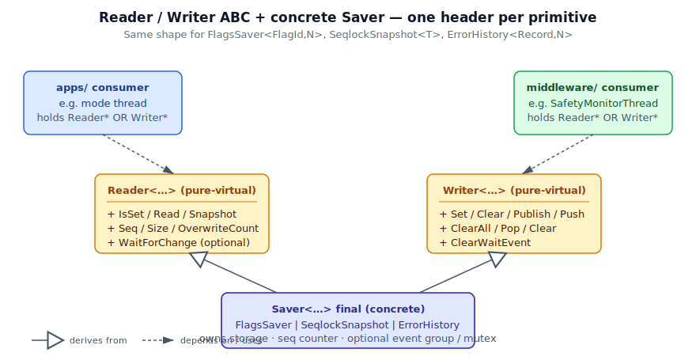
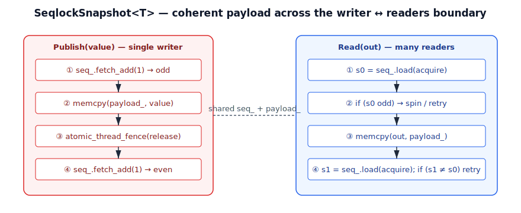

# hf-utils-rtos-wrap

Hardware-agnostic RTOS helper library for the HardFOC stack. Wraps FreeRTOS
primitives with modern C++ classes and adds three lock-free / lock-light
generic templates used pervasively by middleware and apps.

Targets FreeRTOS kernel **11.1.x** (ESP-IDF v5.5 on ESP32-S3 today). Public
surfaces use plain C++ types — `uint32_t`, `enum class`, `std::chrono`-friendly
millisecond timeouts. There are **no** `OS_Ulong`, `OS_OR`, `OS_AND`,
`OS_WAIT_FOREVER` leaks across the library boundary; pass `UINT32_MAX` for an
infinite wait.

This library is the **deepest** node in the HardFOC submodule chain — it must
not include from any sibling or parent. See the layering rules in the project
[`AGENTS.md`](../../../../../../AGENTS.md).

---

## Header summary

Required by project `AGENTS.md`: every header carries `@file` / `@brief`,
a thread-safety note, and an allocation-behavior note.

| Header | Purpose | Thread-safety | Allocation |
|---|---|---|---|
| [`OsAbstraction.h`](include/OsAbstraction.h) | C-facing portability layer (FreeRTOS today; ThreadX / Zephyr future) | Pass-through; safety follows underlying primitive | Inline typedefs only |
| [`OsUtility.h`](include/OsUtility.h) | C helpers for delay / cycle counts / queue / event-group / timer / mutex / stream-buffer creation | Pass-through to RTOS handles | Most `*_create_*` allocate the underlying RTOS object once |
| [`Utility.h`](include/Utility.h) | `WaitForCondition` template + small time helpers | Caller-supplied predicate dictates safety | None |
| [`RtosMutex.h`](include/RtosMutex.h) | `std::lock_guard`-compatible mutex (used by handlers, managers, API) | Internal RTOS mutex; lock / try-lock / unlock | Allocates the handle on construction |
| [`Mutex.h`](include/Mutex.h) | Named mutex wrapper used by `BaseThread` infrastructure | Internal RTOS mutex | Allocates the handle on construction |
| [`MutexGuard.h`](include/MutexGuard.h) | RAII guard for `Mutex` with timeout | Locks/unlocks the wrapped mutex | None |
| [`CriticalGuard.h`](include/CriticalGuard.h) | RAII helper for `portENTER_CRITICAL` / `portEXIT_CRITICAL` | Disables interrupts in scope | None |
| [`SignalSemaphore.h`](include/SignalSemaphore.h) | Named binary semaphore for start/stop / wake events | Internal RTOS semaphore | Allocates the handle on construction |
| [`OsQueue.h`](include/OsQueue.h) | `OsQueue<T, Capacity>` typed message queue | FreeRTOS queue is MT-safe; no extra mutex | Eager-construct in ctor; inline storage; no heap |
| [`OsEventFlags.h`](include/OsEventFlags.h) | `OsEventFlags` event-group wrapper with `WaitMode::{Any, All}` | FreeRTOS event group is MT-safe; no extra mutex | Eager-construct in ctor |
| [`PeriodicTimer.h`](include/PeriodicTimer.h) | RAII wrapper around FreeRTOS software timers | Backed by FreeRTOS timer service task | Allocates the handle on `Create()` |
| [`FreeRTOSUtils.h`](include/FreeRTOSUtils.h) | Return-code → string + small debug helpers | Pure functions; no shared state | None |
| [`BaseThread.h`](include/BaseThread.h) | Abstract worker thread (`Setup` / `Step` / `Cleanup`) with verified start / stop | Per-thread state; controlled via internal semaphores | Caller supplies the stack buffer; class never heap-allocates |
| [`BaseThreadsManager.h`](include/BaseThreadsManager.h) | Optional registry that starts / stops a group of `BaseThread`s together | Internal mutex around the registry | Uses `std::map` (allocates per-registration) |
| [`FlagsSaver.h`](include/FlagsSaver.h) | `hf::FlagsReader` / `FlagsWriter` ABCs + concrete `hf::FlagsSaver<FlagId, N>` two-state bitset | Lock-free reads & writes (atomic `uint64_t` words); waiter via event group | No heap; fixed `(N + 63) / 64` word array; event group lazy |
| [`SeqlockSnapshot.h`](include/SeqlockSnapshot.h) | `hf::SnapshotReader` / `SnapshotWriter` ABCs + concrete `hf::SeqlockSnapshot<T>` coherent snapshot | Single-writer / many-reader seqlock | No heap; inline `T`; event group lazy |
| [`ErrorHistory.h`](include/ErrorHistory.h) | `hf::ErrorHistoryReader` / `Writer` ABCs + concrete `hf::ErrorHistory<R, N>` ring buffer | All ops under internal `RtosMutex` | No heap; inline `Record[N]` |

---

## Architecture at a glance

The three Phase 2C generic templates all share the same shape — a pure-virtual
**Reader** ABC, a pure-virtual **Writer** ABC, and a concrete **Saver** that
derives from both. Hand a `Reader*` to subscribers that may only inspect, hand
a `Writer*` to producers — the type system then enforces the apps ↔ middleware
layering rules from `AGENTS.md`.



`SeqlockSnapshot<T>` uses a classic single-writer / many-reader seqlock so that
readers never block the writer and the writer never blocks readers:



---

## Quick examples

### `BaseThread`

```cpp
#include "BaseThread.h"

class MotorTask : public BaseThread {
public:
    MotorTask() : BaseThread("MotorTask") {}
    bool     Setup()   override { return true; }
    uint32_t Step()    override { /* control loop */ return 10; /* ms */ }
    bool     Cleanup() override { return true; }
};

static MotorTask  worker;
static uint8_t    stack[2048];

void app_main() {
    worker.CreateBaseThread(stack, sizeof(stack), /*priority=*/5, 0, 0, OS_AUTO_START);
    worker.StartThreadAndWaitToVerify();
}
```

### `OsQueue` (modernized — no `Send`-time mutex, no lazy init)

```cpp
#include "OsQueue.h"

OsQueue<int, /*Capacity=*/64> q{"Numbers"};

q.Send(42);                                 // blocks forever
int v;
if (q.Receive(v, /*timeout_ms=*/100)) {
    // got value
}
```

### `OsEventFlags` (modernized — strongly-typed `WaitMode`)

```cpp
#include "OsEventFlags.h"

OsEventFlags<> flags;
flags.Set(0x3);

uint32_t got = 0;
if (flags.Wait(/*bits=*/0x3, WaitMode::All, /*timeout_ms=*/50, got)) {
    // both bits arrived
}
```

### `hf::FlagsSaver` (Phase 2C)

```cpp
#include "FlagsSaver.h"

enum class SystemFlag : uint8_t { kReady = 0, kFault, kCount };
hf::FlagsSaver<SystemFlag, static_cast<size_t>(SystemFlag::kCount)> flags;

// Producer (any task)
flags.Set(SystemFlag::kReady, /*now_ms=*/os_get_tick_ms());

// Consumer
if (flags.IsSet(SystemFlag::kReady)) { /* … */ }
flags.WaitForChange(/*timeout_ms=*/100);
```

### `hf::SeqlockSnapshot` (Phase 2C)

```cpp
#include "SeqlockSnapshot.h"

struct ManifoldSnapshot { /* trivially copyable POD */ };
hf::SeqlockSnapshot<ManifoldSnapshot> latest;

// Single writer (aggregator thread)
latest.Publish(snapshot);

// Many readers (anywhere)
ManifoldSnapshot out;
auto seq = latest.Read(out);
```

### `hf::ErrorHistory` (Phase 2C)

```cpp
#include "ErrorHistory.h"

struct ErrorRecord { uint32_t ts_ms; uint16_t code; char src[16]; };
hf::ErrorHistory<ErrorRecord, /*Capacity=*/32> history;

history.Push(ErrorRecord{ /* … */ });

ErrorRecord buf[32];
auto n = history.Snapshot(buf, 32);
```

---

## Documentation

Start at [`docs/index.md`](docs/index.md) for the full set of guides.

| Topic | Doc |
|---|---|
| Threading | [`docs/BaseThread.md`](docs/BaseThread.md) |
| Synchronization | [`docs/Synchronization.md`](docs/Synchronization.md) |
| Queues | [`docs/Queues.md`](docs/Queues.md) |
| Generic templates (FlagsSaver / SeqlockSnapshot / ErrorHistory) | [`docs/GenericTemplates.md`](docs/GenericTemplates.md) |
| RTOS abstraction | [`docs/RTOSAbstraction.md`](docs/RTOSAbstraction.md) |
| Periodic timers | [`docs/Timers.md`](docs/Timers.md) |
| Misc utilities | [`docs/Utility.md`](docs/Utility.md) |

---

## License

GNU GPL v3.0. See [`LICENSE`](LICENSE).
